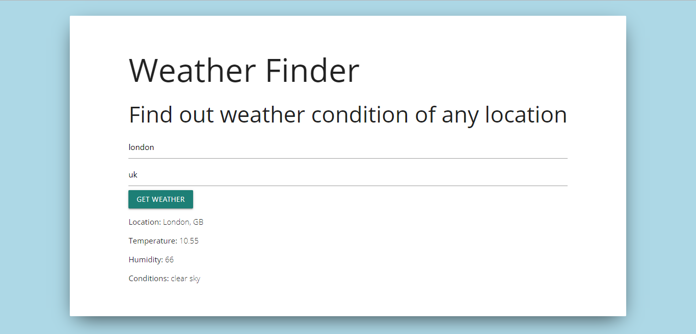
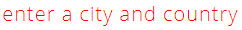
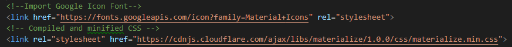
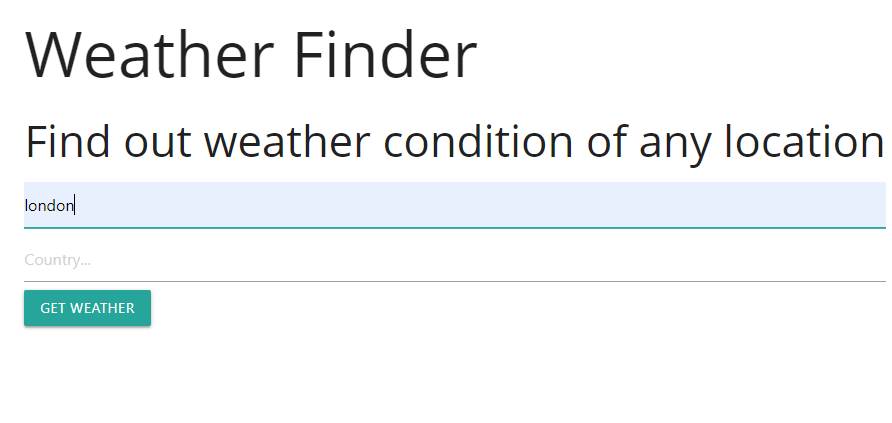
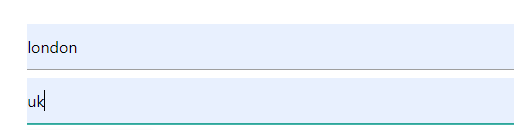
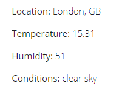

# 
# Weather Finder
<table>
<tr>
<td>
  This is a simple weather app to find out weather condition of any location as it's mentioned in the app itself!
</td>
</tr>
</table>

 

- [Motivation](#motivation)
- [Description of features](#description-of-features)
- [Installation and set up guide](description-of-features)
- [How to](#how-to)
- [API reference](#api-reference)
- [Built with](#built-with)
- [Demo](#demo)
- [Contact information](#contact-information)
- [License](#license)

---

## Motivation

- Through this web app you can get data from [OpenWeatherMap](https://openweathermap.org/) website and get accurate weather information any time of the day.
- I have decided to make this app because this seemed like something useful for everyone. You need to check weather every time you need to go out of your home and it is an easy and convenient way of checking weather no matter where you are residing.

## Description of features

The app asks for specific city name and the name of the country where the city belongs. If the user **clicks** on the button  the user can get the current **Location**, **Temperature**, **Humidity** & **Conditions** of the city that was in the input. In case the user doesn't give any input and clicks the button, then the user gets **warning messsage**: 

## Installation and set up guide

#### Available Scripts:

In the project directory, you can run:

#### `npm start`

Runs the app in the development mode. 
Open [http://localhost:3000](http://localhost:3000) to view it in the browser.

The page will reload if you make edits. 
You will also see any lint errors in the console.

#### `npm test`

Launches the test runner in the interactive watch mode. 
See the section about [running tests](https://facebook.github.io/create-react-app/docs/running-tests) for more information.

#### `npm run build`

Builds the app for production to the `build` folder. 
It correctly bundles React in production mode and optimizes the build for the best performance.

The build is minified and the filenames include the hashes. 
Your app is ready to be deployed!

See the section about [deployment](https://facebook.github.io/create-react-app/docs/deployment) for more information.

#### `npm run eject`

**Note: this is a one-way operation. Once you `eject`, you can’t go back!**

If you aren’t satisfied with the build tool and configuration choices, you can `eject` at any time. This command will remove the single build dependency from your project.

Instead, it will copy all the configuration files and the transitive dependencies (Webpack, Babel, ESLint, etc) right into your project so you have full control over them. All of the commands except `eject` will still work, but they will point to the copied scripts so you can tweak them. At this point you’re on your own.

You don’t have to ever use `eject`. The curated feature set is suitable for small and middle deployments, and you shouldn’t feel obligated to use this feature. However we understand that this tool wouldn’t be useful if you couldn’t customize it when you are ready for it.

#### More info:

You can learn more in the [Create React App documentation](https://facebook.github.io/create-react-app/docs/getting-started).

To learn React, check out the [React documentation](https://reactjs.org/).

##### Code Splitting

https://facebook.github.io/create-react-app/docs/code-splitting

##### Analyzing the Bundle Size

https://facebook.github.io/create-react-app/docs/analyzing-the-bundle-size

##### Making a Progressive Web App

https://facebook.github.io/create-react-app/docs/making-a-progressive-web-app

##### Advanced Configuration

https://facebook.github.io/create-react-app/docs/advanced-configuration

##### Deployment

https://facebook.github.io/create-react-app/docs/deployment

##### `npm run build` fails to minify

https://facebook.github.io/create-react-app/docs/troubleshooting#npm-run-build-fails-to-minify

- Make sure these two links are available in the `index.html` file 

## How to

- Fill in the form by typing the name of the desired **City**

- Add the **Country** of that city

 

- Click **Get Weather** button

 

- And see the result :)

## API reference

Api keys for different functionality with documentation can be found in Open Weather Map's official site's [API page](https://openweathermap.org/api "https://openweathermap.org/api"). You need to register and generate your own key to use.

## Built with 

- [Create React App](https://github.com/facebook/create-react-app "https://github.com/facebook/create-react-app") - Sets up a react app quickly and easily by running one commend.
- [Materialize](https://materializecss.com/ "https://materializecss.com/") - A responsive front-end framework based on Material Design.

## Demo
Working app demo: https://my-weather-app-6e145.firebaseapp.com/

## Contact information
- website: https://sharmins-portfolio-2019.firebaseapp.com/
- e-mail: sharmin.rahman@outlook.com

## License
Released under the [MIT License](https://opensource.org/licenses/MIT).